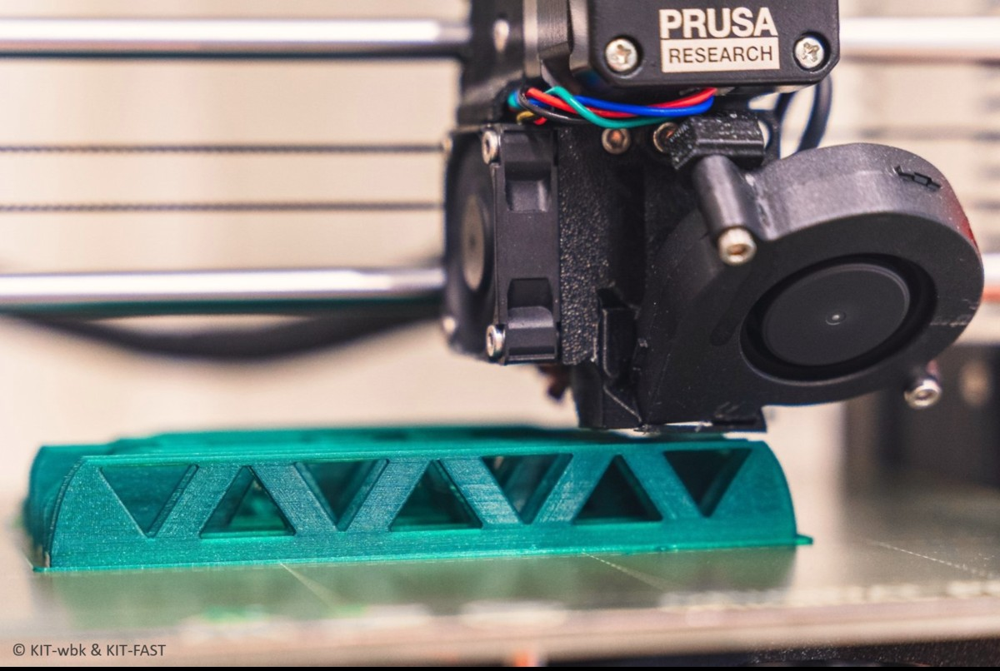
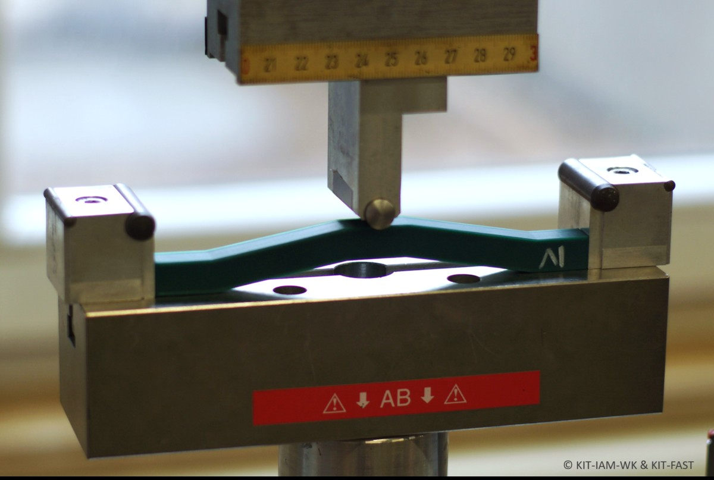

The internship was part of BOGY (Berufs- und Studienorientierung an Gymnasien), the career orientation programme of grammar schools in Baden-Württemberg.

The students' task was to design a bridge for a bending load that is as light and as stiff as possible.
Over five days they went through the stages of developing a lightweight part: they modelled and calculated their designs with computer-aided design and engineering software, printed them on 3D printers and tested whether their concepts held.
Each of the five units was organised by one of the institutes. At the end of the week, the students presented their results and discussed them with the researchers.

Photos: KIT (wbk, IAM-WK and FAST).
